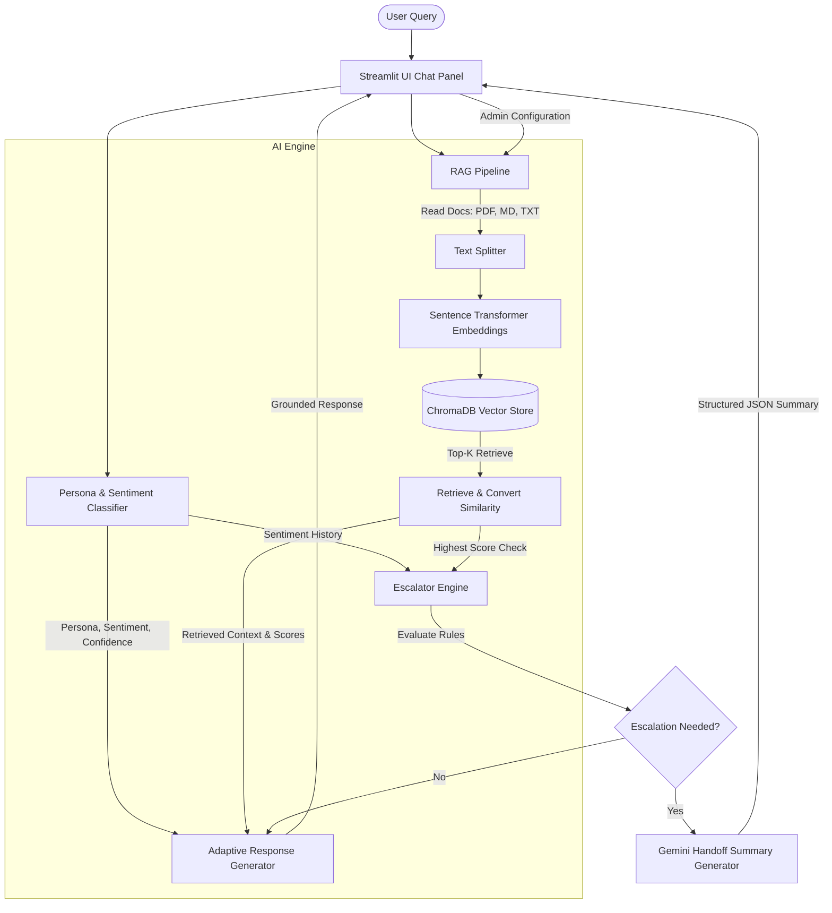

# Persona-Adaptive Customer Support Agent

An advanced, production-ready AI Customer Support Agent built with Python 3.11, Streamlit, Gemini (2.5 Flash), ChromaDB, and local Sentence Transformers. The agent dynamically adapts its response style, level of detail, and empathy based on the detected customer persona (Technical Expert, Frustrated User, or Business Executive) and handles automated multi-criteria escalations with structured JSON handoff summary packages.

---

## Key Features

1. **Automatic Persona & Sentiment Detection**:
   - Classifies customer queries dynamically using Gemini.
   - Detects three target personas: *Technical Expert*, *Frustrated User*, and *Business Executive*.
   - Evaluates customer sentiment (Positive, Neutral, Negative) in real-time.

2. **Retrieval-Augmented Generation (RAG)**:
   - Indexes and searches support knowledge bases stored in a local directory (`data/support_docs`).
   - Supports **PDF**, **Markdown**, and **TXT** file parsing.
   - Computes local embeddings using the HuggingFace `all-MiniLM-L6-v2` Sentence Transformer model.
   - Saves vectors in a local, persistent **ChromaDB** store.
   - RAG responses are strictly grounded in retrieved documents to prevent hallucinations.

3. **Adaptive Response Formulation**:
   - **Technical Expert**: High detail, structural analysis, error/root cause lookup, and technical code blocks.
   - **Frustrated User**: Comforting and apologetic language, high empathy validation, minimal jargon, and direct step-by-step resolution checklists.
   - **Business Executive**: Quick summary (bottom line first), focus on SLAs/timelines/business impacts, and zero technical jargon.

4. **Multi-Criteria Escalation Engine**:
   - Triggers human transfer under six distinct rules:
     - No relevant documents matching the request.
     - Highest retrieval similarity score is below the configured threshold.
     - Sensitive billing or refund topics detected.
     - Legal compliance, GDPR, or SOC2 concerns detected.
     - Account-sensitive security issues (lockouts, manual 2FA reset).
     - Customer remains dissatisfied (negative sentiment for multiple consecutive turns).
   - Dynamically compiles a **Human Handoff Summary** formatted as a structured JSON object.

5. **Diagnostic Dashboard UI**:
   - Renders a chat stream alongside interactive diagnostic panels.
   - Visualizes classification confidence, sentiment logs, retrieval sources, and similarity scores.
   - Features admin triggers to refresh the database or generate default documentation.

---

## System Architecture



---

## Folder Organization

```
persona-support-agent/
│
├── data/
│   ├── support_docs/          # Contains the 15 SaaS support files (PDF, TXT, MD)
│   └── chromadb/              # Persistent ChromaDB database files
│
├── src/
│   ├── __init__.py
│   ├── config.py              # Configuration manager and path initializers
│   ├── utils.py               # PDF/MD parsers, logging set, and retry decorator
│   ├── classifier.py          # Gemini persona/sentiment classifier
│   ├── rag_pipeline.py        # Vector embedding generator and ChromaDB manager
│   ├── generator.py           # Persona-adaptive system-prompt processor
│   └── escalator.py           # Multi-criteria checks and handoff JSON model
│
├── app.py                     # Streamlit frontend application dashboard
├── generate_kb.py             # Pre-generates the 15 SaaS support files
├── requirements.txt           # Python library dependencies
├── .env.example               # Environment variables configuration template
└── README.md                  # Project documentation
```

---

## Setup & Running Instructions

### 1. Prerequisites
- Python 3.11 installed.
- A Google Gemini API Key. Get one at the [Google AI Studio](https://aistudio.google.com/).

### 2. Installation
Clone or navigate to the project directory and run:

```bash
# Install dependencies
pip install -r requirements.txt
```

### 3. Environment Configuration
Create a `.env` file in the root directory (or copy from `.env.example`):

```bash
copy .env.example .env
```

Open `.env` and fill in your Gemini API Key:
```env
GEMINI_API_KEY=your_actual_gemini_api_key_here
```
*(Note: You can also input or change your API key inside the Streamlit web dashboard sidebar at runtime).*

### 4. Build Knowledge Base
Generate the 15 default support documents and index them in ChromaDB by running:

```bash
# Pre-generate the 15 support files (including password_reset_guide.pdf)
python generate_kb.py
```

### 5. Launch the Application
Run the Streamlit server:

```bash
streamlit run app.py
```
Your default browser will automatically open the app at `http://localhost:8501`.

---

## Example Queries to Test

### 1. Technical Expert Persona
* **Query**: `"How can I authenticate our Python client programmatically? Give me a code example and the HTTP headers I need."`
* **Expected Output**:
  - **Persona**: Technical Expert (High Confidence)
  - **Style**: Detailed, formatting code snippets (matching `api_authentication.md`), listing exact headers (`Authorization: Bearer <key>`) and error codes like `401 Unauthorized` and `403 Forbidden`.

### 2. Frustrated User Persona
* **Query**: `"My account is locked out and I've tried logging in 5 times! I have a huge deployment in an hour and this stupid software is blocking me. Fix it right now!"`
* **Expected Output**:
  - **Persona**: Frustrated User
  - **Style**: Extremely empathetic ("I understand how critical this is...", "I'm so sorry this is blocking your deployment"). Provides simple instructions (self-service unlock, waiting 30 minutes, or contacting organization admin).
  - **Escalation**: Will trigger an escalation because of the keyword "lockout" / account-sensitive security, rendering the **Human Handoff Summary** JSON.

### 3. Business Executive Persona
* **Query**: `"What is the policy for subscription cancellations? How long do you retain our organization's database records after we cancel?"`
* **Expected Output**:
  - **Persona**: Business Executive
  - **Style**: Direct, bullet points, business impacts. States the 90-day retention policy (from `subscription_management.md` or `data_export_guide.md`) and how to trigger a manual export (JSON/CSV) without deep developer jargon.

---

## Future Improvements

1. **Hybrid Retrieval (Keyword + Vector)**: Add BM25 keyword search alongside vector search in ChromaDB to handle exact string queries (e.g. searching exact error codes like `Err-1002`).
2. **Re-ranking**: Introduce a cross-encoder model (e.g. Cohere rerank or local SentenceTransformers cross-encoder) to optimize retrieval relevance before LLM response generation.
3. **MFA Self-Service Security Sandbox**: Connect the account unlock process to a real secondary email provider to demonstrate a live end-to-end security handoff.
4. **CRM Integration**: Export the generated **Human Handoff Summary** directly to third-party tools like Zendesk, HubSpot, or Jira via webhooks.
