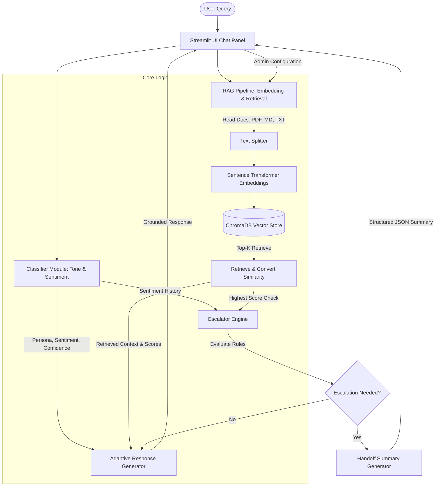

# Persona-Adaptive Customer Support Agent

A production-ready customer support intelligence system designed to process user queries, classify tone and target user personas dynamically, and query local vector databases for grounded context-based responses. 

The system leverages **Python 3.11**, a modular design pattern, **Streamlit** for the dashboard UI, **ChromaDB** for local vector storage, and **Sentence Transformers** (`all-MiniLM-L6-v2`) for local, cost-free embeddings generation. LLM functions (adaptive response layout, user classification, and automated handoffs) are integrated via the **Gemini 2.5 Flash** endpoint.

---

## Architecture Overview

The system is split into independent micro-modules to enforce strong separation of concerns:



### Module Breakdown
* **`app.py`**: Streamlit dashboard orchestrating session state, messaging loops, and diagnostics logging.
* **`src/config.py`**: Configuration singleton resolving environment values, path initializers, and escalation parameters.
* **`src/utils.py`**: Parsing utility including PyPDF loaders, Markdown header regex mapping, standard logging initializers, and exponential backoff retry wrappers.
* **`src/classifier.py`**: Semantic classification block executing persona and sentiment detection using structured JSON output.
* **`src/rag_pipeline.py`**: Embeddings engine, document chunking rules, and database CRUD interface using ChromaDB.
* **`src/generator.py`**: Grounded response factory applying distinct system instructions based on the active persona.
* **`src/escalator.py`**: State machine evaluating threshold matches, billing/legal/account blacklists, and sentiment histories.

---

## Core System Mechanics

### 1. Dynamic Persona Classification
The classifier evaluates tone, vocabulary, and sentence structures to route queries into three distinct lanes:
- **Technical Expert**: Detailed explanations, error root causes, and clean code blocks.
- **Frustrated User**: Calming tone, high-empathy validation, simple explanations, and step-by-step checklists.
- **Business Executive**: Summary-first formats, business impacts, resolution timelines, and minimal jargon.

### 2. Zero-Hallucination RAG Grounding
The RAG pipeline generates local embeddings to index documents. During response generation, strict constraints are passed to the model to guarantee that responses are formed **only** using facts from the retrieved chunks. If the information is not in the context, the agent gracefully refuses to answer rather than hallucinating details.

### 3. Multi-Criteria Escalation & JSON Handoff
Tickets are immediately escalated to human agents if:
1. RAG retrieval returns no documents or matches fall below the confidence threshold.
2. The query contains billing, invoice, or refund keywords.
3. Legal, compliance, or privacy issues (GDPR/SOC2) are detected.
4. Account-sensitive triggers are hit (manual MFA reset or lockouts).
5. The customer's sentiment is verified as `Negative` for two or more consecutive turns.

Upon escalation, a structured handoff payload is generated:
```json
{
  "persona": "Frustrated User",
  "issue": "User locked out of corporate account after 5 failed login attempts.",
  "conversation_history": [
    "User: I've tried logging in 5 times and nothing works, this is urgent!",
    "Agent: I understand this is blocking your work. Let's get this resolved..."
  ],
  "documents_used": ["account_lockout.md"],
  "attempted_steps": ["Self-service unlock email triggered"],
  "recommendation": "Perform manual security checks and reset customer lockout flag."
}
```

---

## Setup & Run Instructions

### 1. Dependencies
Ensure you are using **Python 3.11**. Install required packages:
```bash
pip install -r requirements.txt
```

### 2. Environment Configurations
Create a `.env` file in the root workspace directory matching `.env.example`:
```env
GEMINI_API_KEY=your_gemini_api_key_here
CHROMA_DB_DIR=data/chromadb
DATA_DIR=data/support_docs
ESCALATION_THRESHOLD=0.45
EMBEDDING_MODEL_NAME=all-MiniLM-L6-v2
GEMINI_MODEL_NAME=gemini-2.5-flash
```

### 3. Initialize the Vector Store
Execute the builder script to parse the 15 SaaS support files (including generating `password_reset_guide.pdf` programmatically) and construct the vector DB:
```bash
python generate_kb.py
```

### 4. Launch Streamlit
Start the local dashboard:
```bash
streamlit run app.py
```
Open `http://localhost:8501` to test the chat interface.

---

## Local Test Suite
To verify the entire classification and RAG pipeline programmatically without booting the Streamlit server, execute the testing suite:
```bash
python verify_agent.py
```
This script runs the database check, grounding constraints, and executes the **5 standard demo queries** to log classification details and escalation triggers.
